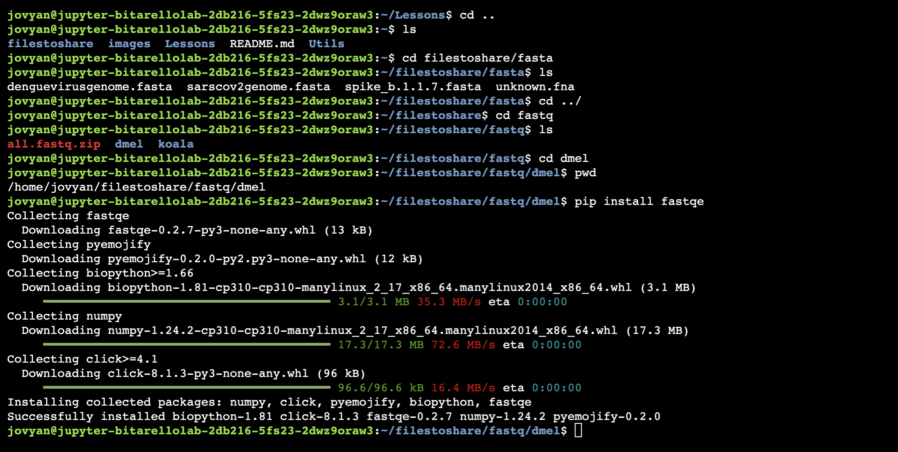
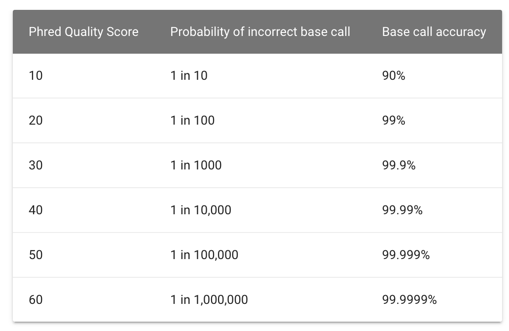

Developed by: Ray Enke, Rachael St. Jaques1, Max Maza, Caylin Murray, Sabrina Robertson, Andrew Lonsdale, & Jason Williams. Modified by Bárbara Bitarello

## Table of Contents

* Introduce students to writing basic command line scripts
* Analyze & assess the quality of FASTQ formatted NGS data
* Trim/filter low quality reads in FASTQ files

## Background 

* The 1st step of any Next Generation Sequencing (NGS) analysis pipeline is checking the quality of the raw sequencing reads in each FASTQ formatted file. If the sequence quality is poor, then your resulting downstream analysis will be inaccurate and misleading. 

* **FastQC** is a popular software used to provide an overview of basic quality metrics for NGS data. In this lesson, you will use an even more universal form of communication to analyze FASTQ files, THE EMOJI 😻😻😻. 

* [FASTQE](https://fastqe.com/) is a program that analyzes FASTQ files & reads out an emoji output as an indicator of the sequence’s quality in the file. So, a high quality read may look like this 😃, while this symbol 💩 indicates... well you get the idea.

* Like the popular FastQC software, FASTQE can be used to analyze FASTQ file quality whether it’s from a genome sequencing project, an RNA-seq project, a ChIP-seq project, etc. Here’s a brief background on the in-class metagenomics project that Dr. Enke’s Bio 481 Genomics class at James Madison University is collecting data for. Garter snakes excrete sexually dimorphic pheromones to attract a mate. 

* The hypothesis of their experiment is that male and female garter snakes host unique microbial communities in their musk glands that contribute to sexually dimorphic bioengineering of these pheromone molecules.


* The FASTQE program is limited to short read NGS data of 500bp/read or less.

---


## Let's install fastqe

Now, create a subdirectory within the one you're in using the "make directory". command

* Usage: mkdir [dir_name]

After you create that directory, head over to it using the "change directory" (cd) command.

## Step 1: Go to the dmel directory

Go to the subdirectory called `dmel` (as in Drosophila melanogaster):

```{bash, echo=T, eval=F}
cd dmel
```

Check

```{bash, echo=T, eval=F}
pwd
```

You should see `/home/jovyan/filestoshare/fastq/dmel`.

## Step 2: Install the fastqe software

In your terminal, type:


````{bash, echo=T, eval=F}
pip install fastqe
```




## Step 3: Running fastqe

* Task: Run the fastqe program to generate your emoji fastq report.

* Usage: fastqe [fastq-file] (run the fastqe program. If a wildcard [e.g. *.fastq] is provided, fastqe will run on all the fastq files in the current working directory.

Note: Remember that fastq files are very large, so this command will take ~30 seconds/

```{bash, eval=F}
fastqe *fastq
```

**Q10) What are the advantages and disadvantages to using the command fastqe .fastq rather than fastqe for each of your files (e.g. fastqe Female2-oral1.fastq ... fastqe Male5-oral1.fastq...) ?**


**Q11) Which one of the three files seems to have lower quality than the others?**


## Step 4: Using the help page


Open the FASTQE help page to view the “optional arguments”, these are all of the options and setting for the program.

To get the help info for fastqe (and many other command line programs) add the --help option to the fastqe program instead of a filename or wildcard (remember to leave a space between fastqe and --help).

```{bash, echo=T, eval=F}
#type your command in your terminal

```
You should see something like this:


Which optional argument will show the version # of FASTQE?

## Step 5. Scale

Add the --scale option to the fastqe command to view the Phred score associated with each emoji in your output. Try this just for the `Male5-oral1.fastq` file (remember to leave a space before you type --scale). This will take a few seconds to run.

```{bash, echo=T, eval=F}
#type your command in your terminal
fastqe Male5-oral1.fastq --scale
```

### Step 6. Quality

The quality, also called phred score, is the probability that the corresponding basecall is incorrect.

Phred scores use a logarithmic scale, and are represented by ASCII characters, mapping to a quality usually going from 0 to 40.




**Q13) Phred score of ≤20 is considered a poor quality base call. How many poor quality base calls are at the 3’ end of this read?**


## Step 7. FASTP

Now let's try a different tool, called fastp. But first, we need to install some pre-req libraries.

Paste into your command line

```{bash, eval=F}
conda config --add channels bioconda
conda config --add channels conda-forge
pip install nodejs
pip install scikit-learn
pip install tensorflow
conda create -n assembly -c conda-forge -c bioconda fastp -y
conda activate assembly
```

FASTP gives a more conventional readout of the .fastq file data. Fastp is similar to the famous FastQC; however, it also has a trimming tool to cut out or filtering the low quality sequences in our file.

Run fastp on the lower quality `Male5-oral1.fastq` file.

```
 Usage (Note: You will need to use all of these elements in your command):

fastp is the name of software that will check the quality of the fastq file
 -i [input.fastq] -i option specifies the input file for fastp
 -o [ouput.fastq] -o option specifies the ouput file for fastp
 --html [ouput.html] --html option specifies the name of the HTML report for fastp
 --json [ouput.json] --json option specifies the name of the JSON report for fastp
```
Write a command using Male5-oral1.fastq as your input and out.Male5-oral1.fastq as your output. Name your --html report Male5-oral1.html and your --json report Male5-oral1.json.

```{base, echo=T, eval=F}
#type your command into your command line

```

You should now have 3 new files in your fastp folder

* .html file (this is your QC report)
* .json file (ignore this for now)
* trimmed fastq file (out.Male5_oral1.fastq)

Click on the fastp.html file in the left sidebar pane inside `filestoshare/fastq/` on the left to examine this report.

**Q14) From the “Summary” data in your HTML fastp report, how many reads are in this FASTQ file before and after filtering?**


## Learn more

[https://fastqe.com/](https://fastqe.com/)

[https://github.com/OpenGene/fastp](https://github.com/OpenGene/fastp)